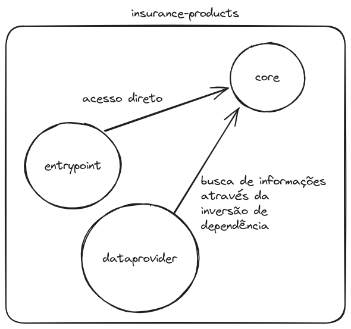
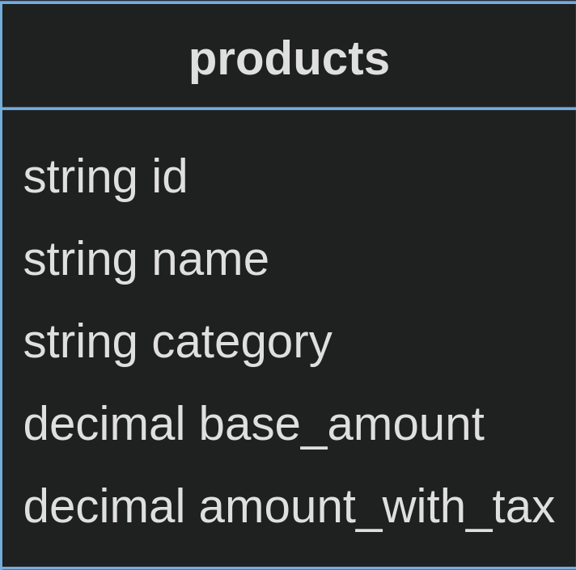
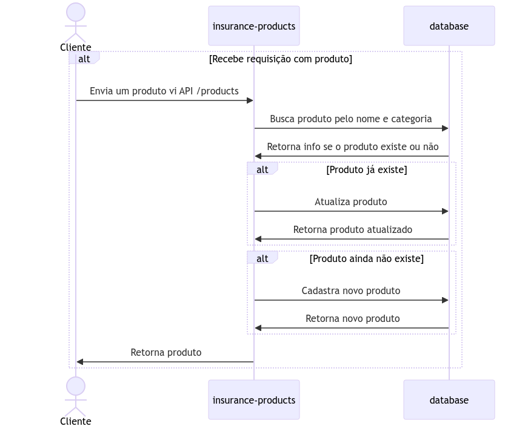

# Produtos de seguro
## Índice
* [Stack](#stack)
* [Rodar o projeto](#rodar_projeto)
    * [Docker](#docker)
    * [Debug (IDE)](#debug_ide)
    * [Testes](#testes)* [Arquitetura Limpa](#arquitetura)
    * [Projeto](#arquitetura_projeto)
* [Banco de dados](#banco_de_dados)
* [Fluxo](#fluxo)


### <a name="stack">Stack</a>
- Java 17
- Maven 3.8.4
- Spring 3.2.0
- MySQL 8.0.33
- REST API
- Jacoco

### <a name="rodar_projeto">Rodar o projeto</a>

### <a name="docker">Docker</a>
Necessário ter o docker e docker-compose instalados. 

- Necessário certificar-se que o campo `pring.datasource.url` do arquivo `application.properties` está configurado conforme abaixo:

```
spring.datasource.url=${SPRING_DATASOURCE_URL}
```

Rodar os comandos abaixo:

```
docker compose build
docker compose up
```

### <a name="debug_ide">Debug IDE</a>
- Aqui é necessário que tenha todas as ferramentas mencionadas em "[Stack](#stack)" e que estejam rodando.
- Necessário certificar-se que o campo `pring.datasource.url` do arquivo `application.properties` está configurado conforme abaixo:

```
spring.datasource.url=jdbc:mysql://localhost:3306/insurance_products?createDatabaseIfNotExist=true&Timezone=UTC]
```

Importar o projeto na sua IDE de preferência e rodar a classe `InsuranceProductsApplication.java`

Dica: Você pode utilizar [esta](https://hub.docker.com/layers/library/mysql/8.0.33/images/sha256-b45a7c3e6fb15526e8bf62ebb940cd460617e36f46155b8514fd9c9388231817?context=explore) imagem docker para o mysql.

### <a name="teste">Testes</a>
Para verificar a cobertura de testes, rode o comando abaixo (com maven instalado):

```
mvn clean install
```

Após a execeção desse comando será criada uma pasta chamada `target` na raiz do projeto. 
Dentro dessa pasta acesse: `./site/jacoco/index.html`

### <a name="arquitetura">Arquitetura Limpa</a>
Este projeto está baseado em Arquitetura Limpa. A ideia dessa aquitetura é fazer com que cada parte do código fique desacoplada, de forma que camadas de entrada ou de busca de informações não acessem o _core_ do sistema, Essa forma de configuração facilita a manutenção do sistema, uma vez que o sistema está mais desacoplado.
Esse desacoplamento se da através da inversão de dependência, fazendo com que seja possível a comunicação entre camadas porém, sem acessa-lás diretamente. Dessa forma nossa camada principal do sistema pode depender apenas de contratos e qualquer um que cumpra esses contratos pode se comunicar com a camada principal do sistema, o que facilita muito a troca de um banco de dados, por exemplo.
Ao usar a arquitetura limpa, inicialmente, pode parecer que existem muitos objetos duplicados e tem mesmo! Acontece que como as camadas não se acessam diretamente é necessário você ter uma representação de produto em cada camada, por exemplo. Outra coisa que pode assustar é a utilização de muitos _gateways_, essas coisas realmente fazem parecer que estamos escrevendo muito código além do necessário mas, uma vez que a arquitetura esté bem estruturada é muito mais fácil fazer alterações (mesmo que pareça que esteja escrevendo mais código), além disso você pode ter muito mais certeza de que suas alterações não irão "quebrar" seu sistema.
Para mais detalhes sobre arquitetura limpa leia [este texto](https://blog.cleancoder.com/uncle-bob/2012/08/13/the-clean-architecture.html).
### <a name="arquitetura_projeto">Projeto</a>
Se você viu o link do uncle bob acima, você deve ter visto muitas camadas no desenho, a arquitetura deste projeto é baseada naquele desenho porém está adaptada.
Nesse sistema existem três camadas: **entrypoint**, **dataprovider**, **core**, abaixo será detalhado sobre cada uma delas.
- **entrypoint**: Camada responsável por receber requisições externas, pode ser via mensageria, enpoint e etc, neste sistemas temos apenas requisições via endpoint REST. **Essa camada tem acesso a camada core e não pode ser acessada por ninguém**.
- **dataprovider**: Camada responsável por buscar informações em sistemas externos, pode ser outro serviço, banco de dados e etc, neste projeto temos apenas acesso ao banco de dados MySQL.**Essa camada tem acesso a camada core e não pode ser acessada por ninguém**.
- **core**: Camada responsável por manter todo o core da aplicação, as regras de negócio **devem** estar aqui. **Essa camada não deve conhecer nenhuma outra camada e pode ser acessada pelo entrypoint e dataprovider **.

Sendo assim, temos uma arquitetura conforme a imagem abaixo:
<p align="center">

</p>
Existem algumas formas de lidar com diferentes camadas, como criar projetos multi-módulos, por exemplo, o que garantiria que as regras de acessos entre camadas não fossem quebradas, uma vez que seria necessário adicionar as camadas como dependência nos módulos. Para simplificar, neste projeto foi utilizado apenas um módulo e para garantir que não haja quebra no acesso entre as camadas foi criado [esse](https://github.com/wendelduarte/insurance-products/blob/main/src/test/java/com/insurance/products/archunit/LayerArchitectureTest.java) teste de arquitetura.

### <a name="banco_de_dados">Banco de dados</a>
Uma vez que esse sistema não está sendo projetado para uma grande quantidade de dados, possui uma estrura bem definida do seu domínio, foi optado por se utilizar um banco de dado SQL, no caso o MySQL.
O banco possui apenas uma tabela, conforme abaixo:
<p align="center">

</p>

### <a name="fluxo">Fluxo</a>
O fluxo presente nesse sistema é bastante simples e pode ser identificado através do diagrama abaixo:
<p align="center">

</p>
